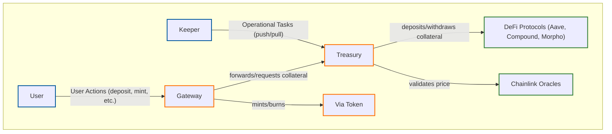

# Via Token

[](https://opensource.org/licenses/MIT)

**viaUSD is a fully collateralized, yield-generating, USD-pegged stablecoin built for DeFi.**

Version 2.0 introduces a modular and robust architecture that separates user interactions, treasury management, and token logic into distinct, auditable contracts. By integrating with premier yield protocols like **Aave, Compound, and Morpho**, viaUSD's collateral is put to work, generating passive yield for the protocol.

## Key Features

-   **Fully Collateralized**: Always backed 1:1 by high-quality stablecoin collateral.
-   **Yield-Generating**: Collateral is deposited into leading DeFi protocols (e.g., Aave, Compound,) to generate yield.
-   **Automated Liquidity Provisioning**: A portion of the generated yield can be used to deepen viaUSD liquidity on decentralized exchanges.
-   **Modular & Secure Architecture**: Core logic is split into `Gateway`, `Treasury`, and `Viat` contracts for clarity and security.
-   **Flexible User Actions**: Users can either specify the input amount (`deposit`/`redeem`) or the desired output amount (`mint`/`withdraw`).
-   **Robust Governance**: A secure Owner-Keeper model separates strategic decisions from routine operational tasks.
-   **Secure and Audited**: Built with security as a first principle, with comprehensive test coverage.

## Architecture Overview

The Via Token system is composed of three core contracts that work in concert to provide a seamless and secure user experience.



### Core Components

1.  **`Gateway.sol`**: The single entry and exit point for all users. It handles the logic for the four primary user actions (`deposit`, `mint`, `redeem`, `withdraw`). To execute all calculations securely, the Gateway queries the `Treasury` for real-time asset prices and uses this data along with fees, price tolerance, and mint limits.
2.  **`Treasury.sol`**: The custodian of all collateral. It manages the whitelist of supported assets, interfaces with yield-generating protocols, and integrates with Chainlink oracles. It serves as the single source of truth for asset prices and risk parameters.
3.  **`Viat.sol`**: The ERC20 stablecoin contract. It includes `ERC20Permit` for gasless approvals and ensures that only the `Gateway` contract can mint new tokens.

## Governance: The Owner-Keeper Model

Via Token employs a two-tiered access control model to enhance security:

-   **Owner**: A highly-secured address (e.g., a multi-sig) responsible for strategic decisions like whitelisting new assets, setting fees, and appointing Keepers.
-   **Keepers**: Authorized addresses with a limited set of permissions for routine operational tasks, such as managing funds between the Treasury and yield vaults or pausing deposits/withdrawals for an asset.

## Local Development

This project uses [Foundry](https://github.com/foundry-rs/foundry).

### Prerequisites

-   [Git](https://git-scm.com/book/en/v2/Getting-Started-Installing-Git)
-   [Foundry](https://book.getfoundry.sh/getting-started/installation)

### Installation & Setup

1.  **Clone the repository:**
    ```bash
    git clone https://github.com/hemilabs/viat.git
    cd viat
    ```

2.  **Install submodules and dependencies:**
    ```bash
    git submodule update --init --recursive
    forge install
    ```

### Compiling

To compile the contracts, run:
```bash
forge build
```

### Testing

To run the full test suite:
```bash
forge test
```
For more verbose output:
```bash
forge test -vvv
```
To calculate test coverage:
```bash
forge coverage
```

## Security and Audits

Security is the highest priority for the Viat protocol. The contracts have been designed with best practices in mind and include:

-   Comprehensive test suite with high branch coverage.
-   Protection against reentrancy attacks.
-   Non-upgradeable core contracts.
-   Strict checks for oracle price staleness and deviation.

*This section will be updated with links to external audit reports once they are completed.*

## License

This project is licensed under the **MIT License**. See LICENSE for more information.